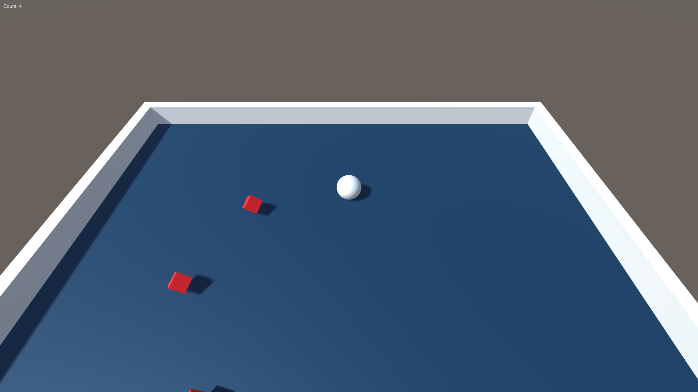

# Unity_roll_the_ball
Description: This is the first game project that I made using the unity!
Author: Zhuoyue Lyu
Time: Jul 12, 2019
## Start the game
If you are on the mac, you could start the game be clicking Game!
## How to play?
Use your direction key to navigate the ball, try hit as many floating cubes as possible.

## Scripts
All the scripts are under the Assets/Scripts folder, there are some Chinese in the comment of the scripts, which was just some notes helping me remember each steps, please ignore it if you don't understand.
